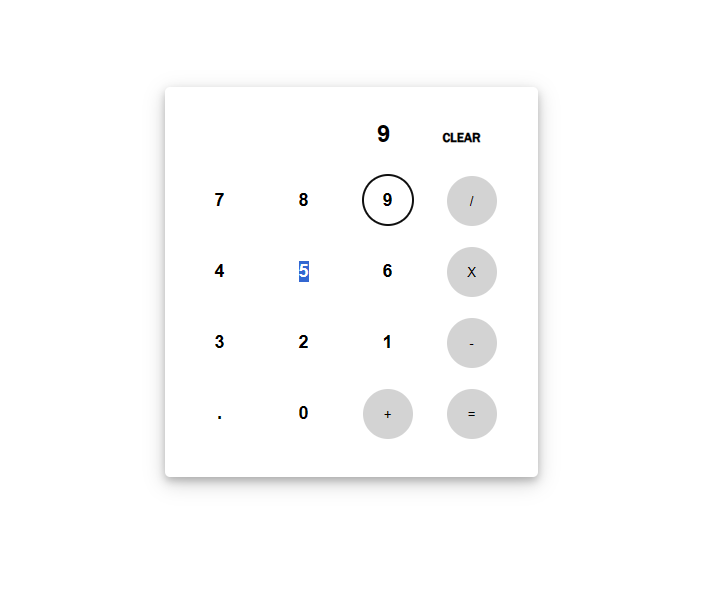

Simple Calculator Project
This project is a basic calculator built using HTML, CSS, and JavaScript. It's designed to perform simple arithmetic operations like addition, subtraction, multiplication, and division.

Features
Addition
Subtraction
Multiplication
Division

Technologies Used
HTML
CSS
JavaScript

